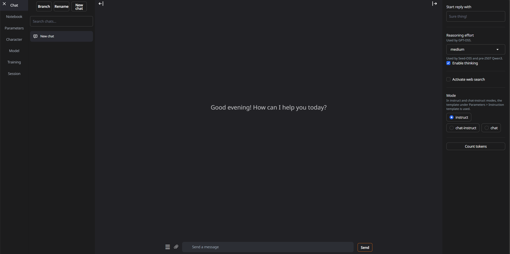

# Лабораторная работа №0. Установка локальной модели Qwen.

<ins>Цель</ins>: установить на рабочую машину локальную модель нейросети Qwen и запустить её.

## План

1. Настройка окружения;
2. Запуск языковой модели;
3. Задания.

---

## 1. Настройка окружения

Первым делом нужно установить Python, если он у вас вдруг не установлен. Для этого нужно перейти на [официальный сайт Python](https://www.python.org/), где во вкладке Downloads выбрать интересующую вас версию (рекомендую 3.10+ из соображений совместимости).

Затем нам потребуется WebUI для интеракций с языковой моделью. Рекомендрую использовать [text-generation-webui](https://github.com/oobabooga/text-generation-webui). Это, пожалуй, самый популярный вариант софта для работы с моделями, он даёт функционал как для простого диалога с нейронками, так и инструменты для их тонкой настройки в случае, если вы решите поэксперементировать (что я максимально одобряю XD).

Для его установки выполните следующие действия:

* Перейдите по указанной выше ссылке;
* Скопируйте адрес репозитория из адресной строки;
* Создайте отдельную папку под вашу софтину для общения с LLMками;
* Откройте эту папку через ваш редактор кода, в терминале пропишите:
```bash
git clone https://github.com/oobabooga/text-generation-webui
```
* После копирования репозитория перейдите в его директорию:
```bash
cd text-generation-webui
```
* Создайте и активируйте виртуальную среду (для Windows):
```bash
python -m venv venv
venv\Scripts\activate
```
* Установите все зависимости:
```bash
pip install -r requirements/portable/requirements.txt --upgrade
```
Также вам необходимо скачать модель Qwen с Hugging Face. Для этого выполните следующие действия:
* Зайдите на раздел [Qwen](https://huggingface.co/Qwen) на Hugging Face;
* Выберите интересующую вас модель. Учитывайте, также вашу видеокарту, ведь на слабых видеокартах может не хватить памяти для загрузки той или иной модели. Для RTX 3070 рекомендую [Qwen2.5-Omni-3B](https://huggingface.co/Qwen/Qwen2.5-Omni-3B), либо [Qwen2.5-3B-Instruct](https://huggingface.co/Qwen/Qwen2.5-3B-Instruct). Квантованные версии для WebUI можно найти в разделе `Quantizations`. В качестве примера я использую [Qwen2.5-Omni-3B-GGUF](https://huggingface.co/ggml-org/Qwen2.5-Omni-3B-GGUF); 
* Скачайте модель в формате GGUF.
* Перейдите в папку `user_data/models` и создайте в ней подпапку `Qwen`.
* Переместите модель в эту подпапку.

## 2. Запуск языковой модели

Для запуска WebUI выполните команду:
```bash
python server.py
```
В случае, если ругается на порт, попробуйте переопределить его через параметр `--listen_port`

После запуска в терминале появится ссылка на WebUI. Перейдите по ней.


Вы увидите главную страницу WebUI.



Перейдите на вкладку `Model`.


В выпадающем списке выберите модель, скачанную вами. Нажмите на кнопку `Load`. После загрузки модели вернитесь на вкладку `Chat`. Пообщайтесь с моделью, поменяйте режимы диалога, эксперементируйте!

## 3. Задания

1. Настройте системный промпт для модели. Опишите в отчёте, к чему это привело.
2. Поменяйте модель на другую. Опишите в отчёте, что поменялось.
3. Поиграйтесь с параметрами модели (temperature, top_p, top_k, repetition_penalty, и т.д.), проанализируйте результат, опишите в отчёте.